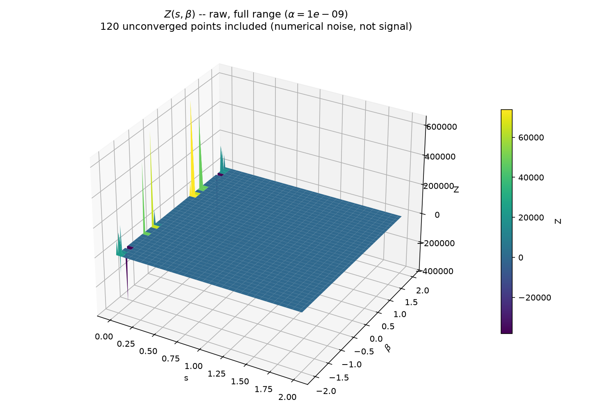
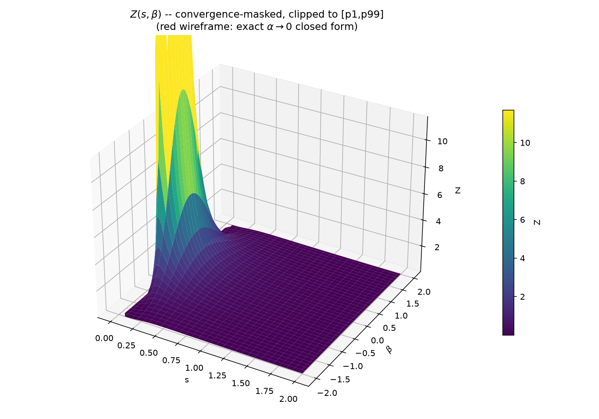
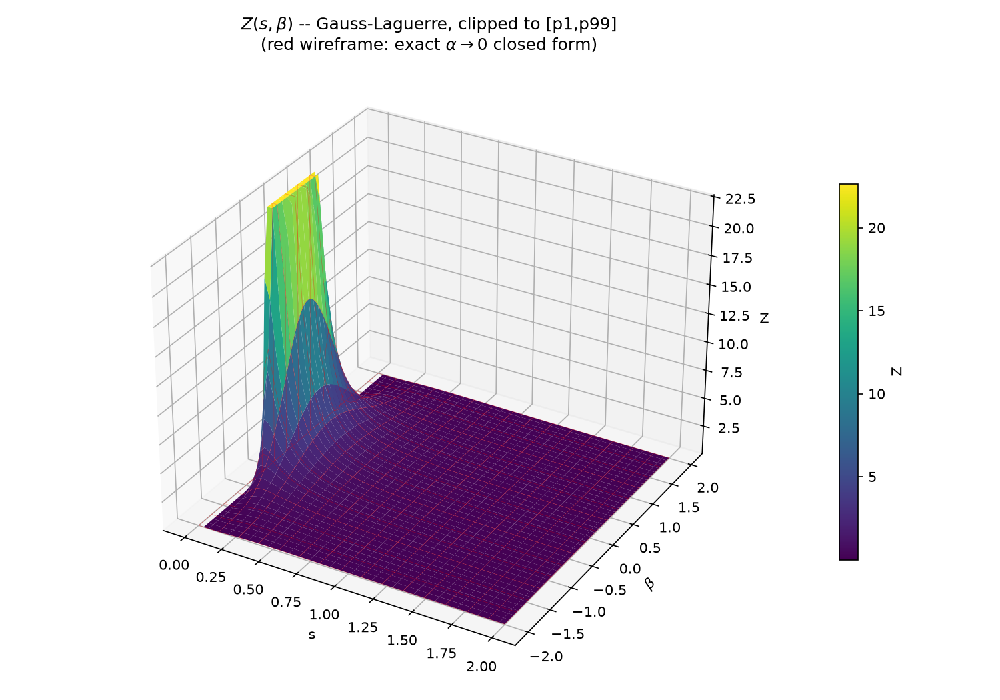

# GUP Heat-Kernel Integral

Numerical evaluation and visualisation of a parametric integral arising from
a Generalized Uncertainty Principle (GUP) heat-kernel calculation in the
accompanying capstone report.

## Overview

This repository evaluates and visualises one surface, `Z(s, beta)`, two
independent ways, then cross-checks both against an exact benchmark:

- **Direct adaptive quadrature** — `scipy.integrate.quad` applied to the
  integral as written (`IntegralNumeric.py`, `PeakInvestigation.py`,
  `plot_surface_stable_integrand.py`).
- **Exact Gauss-Laguerre substitution** — `p = sqrt(t/s)` folded into the
  quadrature weight, no expansion or limit (`gauss_laguerre_integral.py`,
  `plot_surface_gauss_laguerre.py`).
- **Verification** — `verify_integration.py` checks both against the exact
  closed form available as `alpha -> 0` (Weber's second exponential integral).

**Headline finding:** `quad` is correct away from `s ~ 0` (agrees with the
closed form to ~1e-9) but genuinely fails to converge as `s -> 0` — not just
imprecise, but 100% non-converged at the smallest grid values tested. The
Gauss-Laguerre substitution removes that specific failure mode down to a
calibrated reliability floor (`S_MIN_RELIABLE = 0.02`).

`## The journey` below tells the full story of how this was diagnosed and
fixed; `## Getting started` shows what to run first and what to expect;
`wiki/` (start at `wiki/index.md`) has page-level detail on each script and
finding. The table below maps every file to its role.

| Path | Role |
|---|---|
| `IntegralNumeric.py` | First direct-quadrature evaluation; surfaced the small-`s` peak. |
| `PeakInvestigation.py` | Diagnoses the peak as a boundary/convergence artifact. |
| `verify_integration.py` | Validates `quad` against the exact `alpha -> 0` closed form. |
| `plot_surface_stable_integrand.py` | Hardened `quad` + beta=0 fix + twin full/clipped plots. |
| `gauss_laguerre_integral.py` | Exact-substitution Gauss-Laguerre production integrator. |
| `plot_surface_gauss_laguerre.py` | Cross-validation and surface plots for the integrator above. |
| `TestingApparentIntegralDivergences/` | Output plots from the scripts above. |
| `wiki/` | Page-per-topic notes: definitions, findings, and how everything connects. |

## The integral: $\int_0^\infty\frac{p^2(1+\alpha^2p^2)}{\beta}\:\text{exp}\bigl\{ -sp^2(1+\frac23\alpha^2p^2) \bigr\}\:\mathcal{J}_1\bigl( \frac{\beta p}{1+\alpha^2p^2} \bigr)\:dp$

The central object is a one-sided integral over `p in [0, inf)`:

```
I(s, alpha, beta) = int_0^inf  p^2 (1 + (alpha p)^2) / beta
                     * exp( -s p^2 (1 + 2(alpha p)^2/3) )
                     * J_1( beta p / (1 + (alpha p)^2) )  dp
```

where `J_1` is the order-1 Bessel function of the first kind, `s >= 0` is a
damping/regularisation parameter, `alpha` is a GUP deformation parameter, and
`beta = 2 r sin(omega/2)` is a momentum-transfer-like variable. The goal is to
visualise the surface `Z(s, beta) = I(s, alpha, beta)` for fixed, small
`alpha`.

A hard constraint throughout this project: the **numerical** evaluation of
this integral must use no series expansions or limiting approximations — that
algebra is done separately, analytically, in the report. Code-level
evaluation must work with the exact integral.

## The journey

### 1. First attempt — direct quadrature

`IntegralNumeric.py` evaluates `I` directly with `scipy.integrate.quad` over
`p in [0, inf)`, gridded over `(s, beta)` for a few small `alpha`. A sharp,
resolution-sensitive peak appeared at the smallest `s` in the grid.

### 2. Diagnosing the peak

`PeakInvestigation.py` tests whether that peak is real:

- **Lower-bound test** — move the grid's `s_min` away from 0. The peak
  collapses and moves off the boundary.
- **Resolution test** — recompute on the same domain at different grid
  resolutions. The peak's value (even its sign) changes wildly.

Both point to the same conclusion: the peak is a **boundary-cutoff /
non-convergence artifact**, not a physical feature of `I`. At very small `s`,
the damping `exp(-s p^2 ...)` barely suppresses the oscillatory `J_1` tail, so
`quad`'s adaptive subdivision does not actually converge there.

### 3. A second, separate bug

The prefactor `p^2(1+q)/beta` (with `q = (alpha p)^2`) divides by `beta`
directly and diverges as `beta -> 0` — a genuine bug, independent of the
convergence issue above. Using `A2 = beta p/(1+q)`, the algebraically
identical rewrite

```
p^2(1+q)/beta * J_1(A2)  =  p^3 * J_1(A2)/A2
```

is **entire**: `J_1(A2)/A2 -> 1/2` as `A2 -> 0`, removing the singularity with
no expansion or limit involved — just an exact algebraic identity. This fix is
applied throughout (`plot_surface_stable_integrand.py`,
`IntegralNumeric.py`, `PeakInvestigation.py`, `gauss_laguerre_integral.py`).

### 4. Verification against an exact benchmark

`verify_integration.py` checks `quad` against an exact closed form available
in the `alpha -> 0` limit (Weber's second exponential integral):

```
Z(s, beta) -> (1/(4 s^2)) * exp(-beta^2 / 4s)        as alpha -> 0
```

which matches Expression 2.14 of the capstone report (d=4 leading term) up to
a constant factor. Result: `quad` agrees with this benchmark to better than
`1e-8` relative error away from `s ~ 0`, and `Z(s=1, beta=0) = 0.25` exactly
as expected — the surface is **not** "approximately zero" away from small
`s`; it only looked that way because the genuine `1/s^2` divergence near
`s = 0` dominates an autoscaled z-axis. At `s = 1e-6`, however, **100% of
`quad` evaluations are flagged non-converged** — confirming the failure mode
identified in step 2 is real, not just imprecise.

### 5. Visualisation

`plot_surface_stable_integrand.py` hardens `quad` (explicit tolerances,
`full_output=1` non-convergence flagging, a closed-form regression check) and
produces **two** views of the same surface, since a single z-axis cannot show
both the genuine divergence and the underlying smooth structure at once:

- the raw surface, full autoscaled z-axis (shows the real divergence and the
  non-converged points, separately counted);
- a convergence-masked, percentile-clipped surface, with non-converged and
  outlier points set to NaN *before* plotting (avoiding the boundary-wall
  artifact that `matplotlib`'s `set_zlim` alone produces), revealing the
  smooth Gaussian ridge underneath, overlaid against the closed-form
  benchmark.

### 6. A production integrator with no convergence failure

`gauss_laguerre_integral.py` substitutes `p = sqrt(t/s)`, which folds
`exp(-s p^2)` exactly into the Gauss-Laguerre quadrature weight `exp(-t)` —
no expansion, no limit, the same integral exactly rewritten. This removes the
specific failure mode from step 2/4 (the damping is no longer separate from
the quadrature weight) down to a calibrated reliability floor,
`S_MIN_RELIABLE = 0.02`, below which the weighted sum suffers float64
catastrophic cancellation. That floor was confirmed to be a genuine open
numerical-analysis problem — adding more nodes does not help, and even
arbitrary-precision (`mpmath`) quadrature fails the same way there, because
the real difficulty is the highly oscillatory, weakly-damped tail itself, not
floating-point precision. `plot_surface_gauss_laguerre.py` cross-validates
this integrator against both hardened `quad` and the closed form (machine
precision agreement) and produces the same twin full/clipped plots.

## Illustrative plots

Raw surface — genuine `1/s^2` divergence as `s -> 0`, with non-converged
points still included:



Convergence-masked, clipped view of the same grid — the underlying Gaussian
ridge, with the closed-form benchmark overlaid in red:



The exact-substitution Gauss-Laguerre integrator over its reliable domain —
clean and noise-free, with no non-convergence masking required:



## Getting started — what to run first

```
pip install -r requirements.txt
```

Run the three scripts below **in this order** — each builds confidence before
the next. Both plotting scripts save their PNGs into
`TestingApparentIntegralDivergences/` *before* calling a blocking
`plt.show()`, so an interactive window will pop up and the script will pause
until it's closed; the PNGs are written regardless, so a headless run (e.g.
`MPLBACKEND=Agg python ...` on Linux/macOS, or the equivalent
`$env:MPLBACKEND='Agg'` in PowerShell) produces the same files without
blocking.

### Step 1 — `python verify_integration.py`

Read-only, no plots, fastest to run. This proves the numerics are sound
*before* looking at any visualisation. Representative output (abridged):

```
  Worst-case relative error across this grid: 1.242e-09
  -> if small (<<1), quad is CORRECTLY evaluating the integral in
     the well-damped (s not tiny) regime ...

  Representative bulk point  Z(s=1, beta=0)        = 0.25
  Closed-form prediction at (s=1, beta=0)          = 0.25
  Grid Z range                                     = [-1.26818e+06, 1.52969e+06]
  -> the bulk value (~0.25 near beta=0) is dwarfed by the corner spike,
     which is why an autoscaled z-axis makes the bulk LOOK like zero.

  Bad-point count by s-row (first 10 rows, smallest s first):
    s=1e-06: 60 / 60 flagged
    s=0.0689665: 0 / 60 flagged
    ...
```

Look for: worst-case relative error ~1e-9 (i.e. `quad` agrees with the exact
closed form to 9 decimal places away from `s ~ 0`), `Z(s=1, beta=0) = 0.25`
exactly, and **100% of `quad` evaluations flagged non-converged at the
smallest `s` row** while every other row is clean. **Takeaway:** `quad` is
trustworthy in the bulk; the small-`s` failure is a real, total
non-convergence, not mere imprecision.

### Step 2 — `python plot_surface_gauss_laguerre.py`

The clean answer. Prints a cross-validation table comparing the
Gauss-Laguerre integrator against hardened `quad` and the closed form:

```
       s   beta        Laguerre  quad (hardened)    closed form   Lag vs CF quad vs CF
  0.4160   0.00    1.444619e+00     1.444619e+00   1.444619e+00    4.61e-16   0.00e+00
1 / 60 s-rows below S_MIN_RELIABLE=0.02 are masked (known open numerical limitation)
```

Look for: agreement to ~1e-16 (machine precision) almost everywhere. Opens
two windows / writes `gauss_laguerre_full.png` and
`gauss_laguerre_clipped.png` — a clean, noise-free Gaussian ridge, with no
masking needed below the documented reliability floor.

### Step 3 — `python plot_surface_stable_integrand.py`

The diagnostic story — why the masking and the second integrator were
needed. Representative output:

```
Z min = -380015,  Z max = 640817
quad flagged 120 / 7200 points (1.67%) as non-converged
  non-converged rows span s in [1e-06, 1e-06]
Masked 180 / 7200 points (2.50%) for the clipped view
Clipped plot zlim/color limits (p1/p99): [0.00328447, 11.6975]
```

Opens two windows / writes `full_range_raw.png` (spiky near `s -> 0`, the
raw non-convergence noise) and `clipped_masked.png` (the same grid with
non-converged and outlier points NaN-masked, revealing the smooth ridge
underneath).

## Further detail

See `wiki/` for page-level notes on the integral itself, each script, and how
the findings connect — start at `wiki/index.md`.
